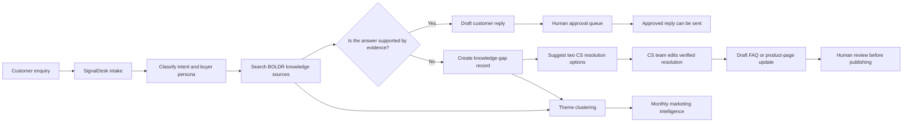
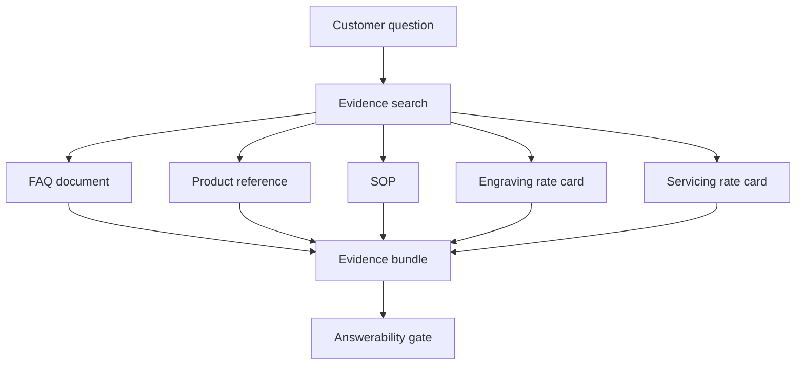
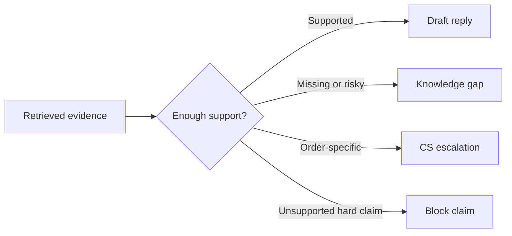
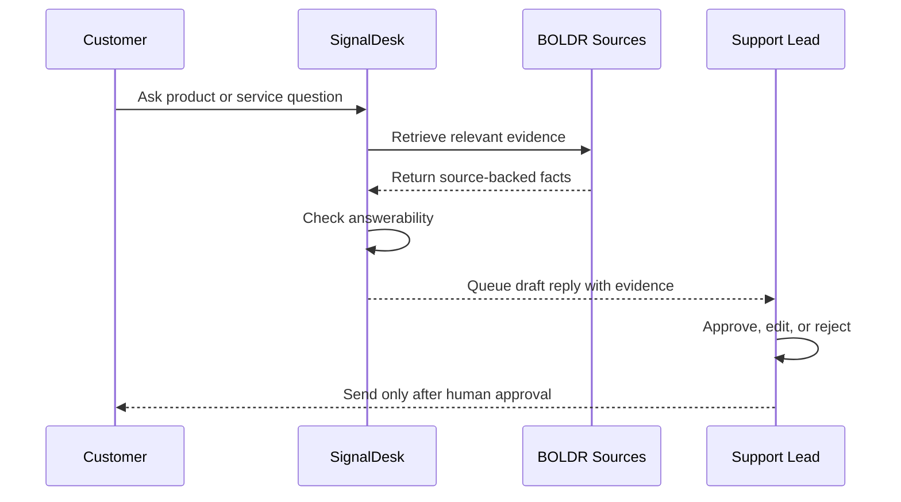
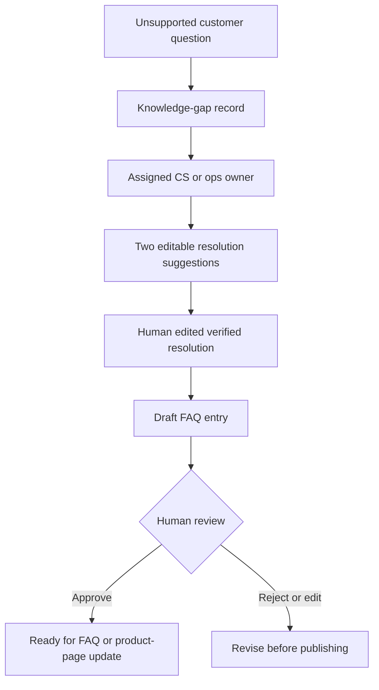
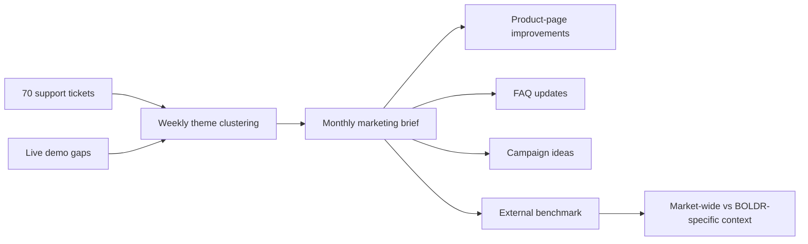
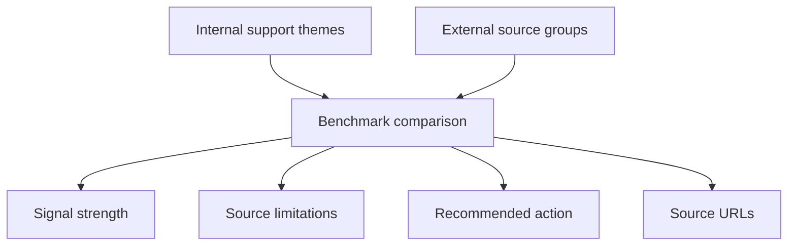

# BOLDR SignalDesk Workflow Documentation

BOLDR SignalDesk is a customer-support intelligence workflow for a small watch e-commerce team. It helps the team answer customer questions faster, avoid unsupported claims, find knowledge-base gaps, and turn repeated enquiries into product-page and marketing improvements.

This document is written for non-technical reviewers. The diagrams use Mermaid, which renders directly in GitHub.

## One-Line Summary

BOLDR SignalDesk converts customer enquiries into evidence-backed support drafts, knowledge-gap records, draft FAQ updates, and marketing insights.

## SME Problem

BOLDR receives customer questions about straps, materials, shipping, engraving, servicing, warranty, sustainability, and product suitability. A small customer-support team can answer these manually, but the work creates four bottlenecks:

1. Staff spend time searching scattered product, FAQ, SOP, and rate-card documents.
2. Similar questions are answered repeatedly without improving the FAQ.
3. Missing information is easy to answer incorrectly unless it is escalated.
4. Valuable buyer-language trends do not reliably reach marketing or product pages.

SignalDesk solves this by turning each enquiry into a guided workflow with evidence checks and human approval.

## Target User

The primary user is a customer support lead or operations manager at a small e-commerce brand. In BOLDR's case, this is the person responsible for keeping support replies accurate, routing gaps to the right owner, and making sure repeated customer questions improve the website and FAQ.

## Big Picture Workflow



The key idea is simple: the system only drafts a direct customer answer when the answer is supported by BOLDR sources. If the information is missing, uncertain, order-specific, or risky, the enquiry becomes a reviewable gap instead of a hallucinated answer.

## Main Data Sources

SignalDesk uses the actual local files available in the project, not invented files from the challenge brief.

| Source | What It Is Used For |
|---|---|
| Customer ticket CSV | Real sample enquiry patterns, intent, and evaluation cases |
| FAQ PDF | Existing customer-facing answers |
| SOP document | Escalation, tone, and operational routing rules |
| Product reference document | Product facts, strap compatibility, materials, and model details |
| Engraving rate card | Pricing and turnaround for engraving |
| Servicing rate card | Pricing and turnaround for servicing |

Rate cards are treated as authoritative for prices, limits, and turnaround times.

## Detailed Workflow Steps

### 1. Enquiry Intake

A support user enters a customer question in the Customer Chat screen. The workflow can also use sample tickets from the dataset for evaluation and demo proof.

Example enquiry:

```text
Are BOLDR FKM straps BPA-free and safe for kids?
```

The system records the enquiry as a demo item and starts a visible processing trace so the reviewer can see what happened.

### 2. Intent And Persona Classification

The system identifies what the customer is asking about and maps the customer to one of the required buyer personas. The persona is used to shape the reply tone and explain the customer's likely concern.

Common enquiry types include:

| Enquiry Type | Example |
|---|---|
| Product suitability | Strap safety, sizing, compatibility |
| Shipping or fulfilment | Delivery timing, order status |
| Engraving | Personalisation, price, timing |
| Servicing | Repair, warranty, turnaround |
| Sustainability | Packaging, carbon-neutral shipping, recycling |
| Gifting | Wedding, corporate, birthday, Father Day use cases |

### 3. Evidence Search

SignalDesk searches BOLDR's available knowledge sources. It does not rely on the model's memory for product facts. It looks for evidence in the FAQ, product reference, SOP, and rate cards.



The evidence bundle is visible in the approval view so a human reviewer can check why the system drafted or blocked a reply.

### 4. Answerability Gate

The answerability gate decides whether the system has enough evidence to draft a customer-facing answer.



This is the most important safeguard in the workflow. The system should not invent product claims, sustainability promises, delivery status, refund status, or technical details that are not supported by the current sources.

### 5. Supported Answer Path

When the answer is supported, SignalDesk drafts a reply and queues it for review.



Human approval is required before a draft becomes customer-facing. The system is a support copilot, not an auto-send chatbot.

### 6. Knowledge-Gap Path

When the answer is not supported, SignalDesk creates a gap instead of guessing.

Example gap enquiry:

```text
Do you offer carbon-neutral shipping or a strap recycling take-back program?
```

If current sources do not prove the claim, the system creates a CS queue item with:

- The customer question.
- The missing knowledge.
- Priority and owner guidance.
- Attempted evidence.
- Suggested next action.
- A safe holding response when appropriate.

In the CS Queue, the support user can click `Suggest resolutions` beside the Verified Resolution field. SignalDesk returns two editable options: an attempted answer based on attempted evidence and a safer customer-wording fallback for cases where the team should say it is checking or cannot confirm yet. The user can insert one option, edit it, and then resolve the gap.

After a human confirms the verified resolution, SignalDesk can draft a new FAQ entry.



The FAQ draft still needs review before publishing. This keeps the knowledge base accurate and approval-first.

## Marketing Intelligence Loop

SignalDesk also turns support patterns into business intelligence. Repeated customer questions become themes, product-page gaps, FAQ opportunities, and campaign ideas.



In the current measured system:

| Metric | Result |
|---|---:|
| Tickets processed | 70 |
| Customer drafts queued | 44 |
| Knowledge-gap tickets blocked from hallucination | 10 |
| Themes detected | 9 |
| Marketing opportunities generated | 6 |
| External source groups benchmarked | 7 |
| Curated external signal mentions | 12 |
| Unsupported hard-claim guardrail failures | 0 |
| Answerability accuracy | about 96% |
| Evidence coverage for answerable tickets | 100% |

## Bonus External Benchmark

The external benchmark compares internal BOLDR support themes against curated external watch-market signals. It is designed to show whether a topic is only a BOLDR support gap or a broader market-wide concern.



The benchmark does not claim to be a live internet crawler in the demo. It is a reviewable benchmark layer with curated external mentions, source groups, signal strength, source limitations, and validation steps.

## Human Safeguards

SignalDesk includes approval gates because customer support content can create brand, legal, or trust risks.

| Risk | How SignalDesk Handles It |
|---|---|
| Unsupported product claim | Blocks the answer and creates a gap |
| Sustainability claim without source proof | Routes to CS review |
| Order-specific question | Escalates instead of inventing status |
| Conflicting source information | Prioritizes authoritative sources such as rate cards |
| Draft answer ready | Requires human approval before sending |
| FAQ update ready | Requires human review before publishing |

Responsible AI failure modes are documented in `docs/responsible-ai.md`, including detection, containment, user-visible behavior, and escalation paths for retrieval misses, source conflicts, contradiction risk, ambiguous queries, and prompt-injection-like phrasing.

## AI And Tooling

The AI layer is configured to use GLM-5.1 through FPT AI Factory when live credentials are enabled. GLM-5.1 is used because this workflow needs structured reasoning over evidence, not only open-ended chat.

For safety and repeatability:

- The AI provider sits behind a replaceable adapter.
- The local demo and automated tests pass without live GLM/FPT credentials.
- `AI_LIVE_ENABLED=false` is the safe default.
- When live credentials are enabled, GLM can draft supported replies and generate the two CS resolution suggestions. The CS helper uses a short live-AI attempt and deterministic customer-safe fallback wording if the provider is slow or unavailable.
- If live credentials are unavailable, the submission should state that the provider adapter is implemented and tests use fake or validated structured outputs.

The workflow was developed with OpenCode, an open-source coding agent.

## Demo Walkthrough For Reviewers

Use this sequence to understand the workflow quickly:

1. Open Customer Chat and reset the demo.
2. Ask an answerable question:
   ```text
   Are BOLDR FKM straps BPA-free and safe for kids?
   ```
3. Review the trace, evidence, and approval queue.
4. Ask a gap question:
   ```text
   Do you offer carbon-neutral shipping or a strap recycling take-back program?
   ```
5. In CS Queue, optionally use `Suggest resolutions`, insert one of the two options, edit it, and resolve the gap.
6. Draft a KB entry and review it.
7. Open Marketing Intel to view theme clustering, monthly brief, and external benchmark.
8. Open System Details to view evaluation metrics and source proof.

## What Makes The Workflow Useful For An SME

SignalDesk is useful because it does not only answer one ticket. It improves the business process around every ticket:

- Faster support replies when evidence exists.
- Safer escalation when evidence is missing.
- Reusable FAQ drafts after human resolution.
- Better product pages from repeated customer questions.
- Marketing ideas based on actual buyer language.
- Reviewable metrics that show whether the workflow is working.

For a small team, the main benefit is that support work stops disappearing after each ticket. It becomes a repeatable loop for customer service, knowledge-base improvement, and revenue insight.
